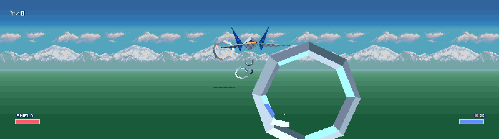

> **Development reference status and credit:** The authoritative Star Fox
> (SNES) PC port project is kandowontu's
> [starfox-enhanced](https://github.com/kandowontu/starfox-enhanced), a decomp
> project and the reference implementation for the custom renderer behavior
> adapted here. This StarFoxSNESRecomp repository is for development reference
> purposes and is not intended to be a production release. Users seeking the
> full Star Fox experience should use
> [starfox-enhanced](https://github.com/kandowontu/starfox-enhanced). I am
> grateful for kandowontu's work and credit that project for the reference
> implementation behind this repo's opt-in native widescreen renderer and
> presentation frame-rate modes.

# StarFoxSNESRecomp

Static recompilation of *Star Fox* (SNES) into native C, using the
[snesrecomp](https://github.com/mstan/snesrecomp) framework. This repository
contains the per-game runtime, recompilation configuration, hardware glue, and
build files. The ROM and ROM-derived generated code are never distributed.

## What "static recompilation" means here

The SNES 65C816 program can run as ahead-of-time compiled native code while
the shared snesrecomp runtime models the console hardware. *Star Fox* also uses
the Super FX/GSU coprocessor extensively. Its low-level execution and
architectural state remain authoritative; compiled paths may optimize that
behavior but must not replace or diverge from it.

## Current status: development reference preview

The game boots and its attract sequence, menus, route selection, training, and
gameplay have passed basic interactive testing. The project includes an opt-in
separate native renderer adapted from kandowontu's Star Fox Enhanced decomp for
widened presentation, with fixed 16:10, 16:9, 21:9, and 32:9 presets. Authentic
4:3 output remains available when the Enhanced Widescreen mod is disabled and
does not use the Enhanced renderer.

Known remaining Enhanced-mode cleanup includes intermittent bottom-edge black
bars, transition artifacting, and incomplete particle/effect parity. Longer
play sessions, additional routes, save-state behavior, and non-Windows builds
still need more coverage. Please report reproducible visual, audio, timing, or
stability problems through [GitHub Issues](../../issues).



## Quick start (Windows release)

1. Download `StarFoxSNESRecomp-windows-0.0.1.zip` from
   [Releases](../../releases) and extract it into a fresh folder.
2. Run `StarFoxSNESRecomp.exe`.
3. In the launcher, choose your legally obtained *Star Fox (USA), version 1.2*
   ROM. The launcher verifies the ROM before enabling play.
4. Review graphics and controller settings, then select **Play**.

The launcher remembers the ROM path. Enable **Skip Launcher on Boot** for
direct startup; pass `--launcher` to show it again.

## Required ROM

Supply your own legally obtained, unheadered 1 MiB dump of **Star Fox (USA),
version 1.2**. The required hashes are:

- CRC32: `8FC4E6D0`
- MD5: `DEF66DB12F5E644C0CF00C42CFA7AE7B`
- SHA-256: `82E39DFBB3E4FE5C28044E80878392070C618B298DD5A267E5EA53C8F72CC548`

The runtime verifies the SHA-256 before starting and caches the selected path
in `rom.cfg`. ROM files, extracted data, and generated recompilation output are
excluded from Git.

## Controls

Default keyboard controls are written to `keybinds.ini` beside the executable
on first launch.

| SNES button | Default key |
|-------------|-------------|
| D-Pad | Arrow keys |
| A | X |
| B | Z |
| X | S |
| Y | A |
| L | C |
| R | V |
| Start | Enter |
| Select | Right Shift |

SDL game controllers are detected automatically. System shortcuts are defined
in `config.ini`:

| Action | Default |
|--------|---------|
| Save state 1-10 | Shift+F1..F10 |
| Load state 1-10 | F1..F10 |
| Toggle pause | P |
| Pause (dimmed) | Shift+P |
| Reset | Ctrl+R |
| Toggle fullscreen | Alt+Enter |
| Turbo / fast-forward | Tab |
| FPS / performance readout | F |
| Toggle PPU renderer | R |
| Presentation debugger | Ctrl+F5 |
| Presentation step forward | Ctrl+F6 |
| Presentation step back | Ctrl+F7 |
| Window size | Ctrl+Up / Ctrl+Down |
| Volume | Shift+= / Shift+- |

## Widescreen

Widescreen output is an opt-in separate native renderer adapted from
`DisplayMode` and renderer work in kandowontu's
[starfox-enhanced](https://github.com/kandowontu/starfox-enhanced) decomp.
Credit for the widescreen renderer design and reference implementation belongs
to the Star Fox Enhanced author and project; this repo integrates that model
with the retail Star Fox recomp runtime.

In the launcher, open **Mods**, enable **Enhanced Widescreen**, and choose one
of the fixed aspect presets:

- `16:10`
- `16:9`
- `21:9`
- `32:9`

Disabling **Enhanced Widescreen** returns to Authentic 4:3. `DisplayMode`,
`Widescreen`, and `EnhancedRenderer` remain accepted as configuration keys for
developer validation, including integer extra pixels per side, but Star Fox
stock rendering remains 4:3. Wider output is only used by the Enhanced native
renderer path.

See [docs/TRUE_WIDESCREEN.md](docs/TRUE_WIDESCREEN.md) for the rendering
model, validation notes, and the remaining spawn/culling audit.

An adaptive display mode is not implemented yet.

## Enhanced-Derived Mods

Set `CrosshairColor` in `config.ini` to `Original`, `White`, `Green`, `Blue`,
`Red`, `Yellow`, `Cyan`, `Magenta`, or `Orange`. `Original` preserves the
retail palette; the other options apply a presentation-only tint to the OBJ
crosshair palette during frame rendering and restore emulated CGRAM before the
next simulation step. The same setting also redirects the Super FX cockpit HUD
triangle color through the bright crosshair palette entry for the current
simulation frame, then restores `M_HUDCOLOUR`.

The `[Features]` section also exposes `GodMode` and `GodNuke`. `GodMode = 1`
reasserts the Enhanced-derived no-collision flag and keeps Nova Bombs at a
floor of three during active gameplay. With `GodNuke = 1`, hold R while firing
a Nova Bomb with A to arm the newly created nuke for the Enhanced-style screen
clear, including the protected boss-shape exceptions from the reference decomp.

Set `ShowFPS = 1` in `[General]` to start with the live on-screen FPS readout
enabled. Like Enhanced, it reports completed presentations in short samples.
The `F` hotkey still toggles it at runtime.

Set `PresentationFPS` to `20`, `30`, `60`, `90`, `120`, `240`, `360`, or
`480` to choose the host presentation cadence. These modes keep SNES
simulation cadence unchanged. Rates below 60 skip presentation draws; rates
above 60 duplicate the newest completed presentation with vsync disabled.
Enhanced-mode native shape poses use presentation interpolation to reduce
object jitter, adapted from the Star Fox Enhanced reference behavior.

## Building from source

Prerequisites are CMake 3.16+, Ninja or another CMake-supported build system,
Python 3.9+, rustup, SDL2, and OpenGL development files.

```bash
git clone --recurse-submodules https://github.com/mstan/StarFoxSNESRecomp
git clone https://github.com/mstan/snesrecomp
git clone https://github.com/mstan/recomp-ui
cd StarFoxSNESRecomp
```

If you cloned without `--recurse-submodules`, initialize the reference sources
before using the comparison tools:

```bash
git submodule update --init --recursive
```

For bounded validation runs, pass `--frames N` after any `--script` or
`--framedump` arguments. This exits cleanly after `N` simulated frames and keeps
launcher UI disabled for automated captures.

Make `snesrecomp/` point to the sibling framework checkout. On macOS or Linux:

```bash
ln -s ../snesrecomp snesrecomp
```

On Windows PowerShell:

```powershell
New-Item -ItemType Junction -Path snesrecomp -Target ..\snesrecomp
```

Place the verified ROM at `starfox.sfc`, generate the local recompilation
output, and build:

```bash
bash tools/regen.sh
cmake -S . -B build -G Ninja -DCMAKE_BUILD_TYPE=Release
cmake --build build
./build/StarFoxSNESRecomp
```

Regeneration builds and requires the fast native analyzer by default. Set
`SNESRECOMP_ANALYSIS_BACKEND=python` only to use the slower reference path.

`src/gen/` is generated locally from the user's ROM and must never be
committed. The exact framework revision expected by this project is recorded
by the `snesrecomp` gitlink.

## Repository layout

| Path | Purpose |
|------|---------|
| `src/` | Game runtime, Super FX integration, configuration, and CPU/PPU glue. |
| `src/gen/` | ROM-derived recompiler output; generated locally and ignored. |
| `recomp/` | Per-bank recompilation declarations and function metadata. |
| `docs/` | Reference-source provenance and development documentation. |
| `snesrecomp/` | Junction or symlink to the sibling framework checkout. |
| `third_party/` | Vendored dependencies retaining their own licenses. |
| `third_party/starfox-enhanced/` | Pinned reference-only decomp used for comparison and symbol provenance. |
| `config.ini` | Runtime graphics, audio, controller, and hotkey settings. |
| `recomp/launcher/` | Star Fox launcher theme and North American cover thumbnail. |
| `tools/make_release.ps1` | Packages a completed MinGW release build and its runtime DLLs. |

## Reference material

Addresses and annotations are checked against the exact-version
[StarFoxDisassembly](https://github.com/SpyderTL/StarFoxDisassembly) reference.
See [docs/REFERENCE_SOURCES.md](docs/REFERENCE_SOURCES.md) for its pinned commit
and usage constraints.

[Star Fox Enhanced](https://github.com/kandowontu/starfox-enhanced) is pinned as
a reference-only decomp submodule for symbol inventory, architecture comparison, and
portable mod research. See
[docs/STARFOX_ENHANCED_COMPARISON.md](docs/STARFOX_ENHANCED_COMPARISON.md) for
the current comparison notes and transfer candidates.

## License

Not yet declared. Original project code and vendored dependencies retain their
respective ownership and licensing status. The *Star Fox* ROM and all data
extracted from it are not part of this repository and are not licensed for
redistribution.

---

<p align="center">
  <sub><b>R.A.I.D. — Retro AI Development</b> · a Discord for AI-assisted retro reverse-engineering, decomp &amp; recomp</sub><br>
  <a href="https://discord.gg/Ad9BwSzctP">Join the R.A.I.D. community</a>
</p>
