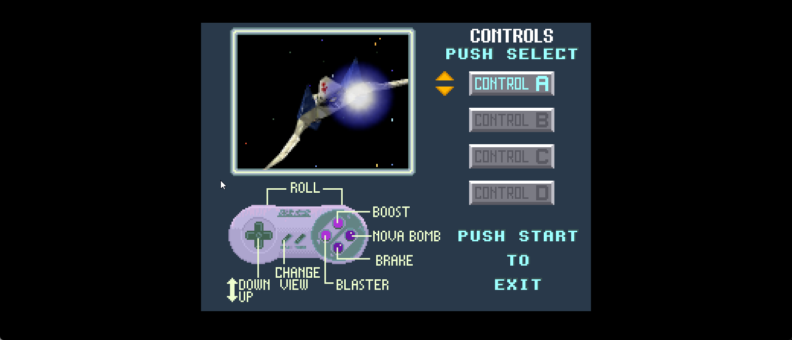

# Star Fox 64 Arwing preview

Arwing64 replaces the player presentation with the Star Fox 64 Arwing, wing
damage variants, engine glow, roll shield, player lasers, and ship sound effects. It works with
Authentic 4:3 and Enhanced widescreen. It is an opt-in development preview.
The owner approved the ship presentation on September 5, 2026; broader route
and release testing is still needed.

The controls screen's ship demonstration also uses the SF64 Arwing. Its
controller diagram, labels and controls remain the SNES game's originals.



The ship is scaled uniformly to the original SNES ship's 72-unit wingspan.
SF64's fully placed open skeleton spans 218.429 units; the smaller closed-pose
bounds must not be used for sizing. The glow and roll shield use the same scale.
The two ships have different proportions, so their length and silhouette differ.

The wings start in SF64's fully opened flight pose. SNES has no matching SF64
wing-opening event, so this uses the original open pose directly, including in
the controls preview. Wing damage still replaces the appropriate wing. Mesh
cache version 3 also fixes wing opacity: the original ship material uses texture
alpha, and its unused zero vertex alpha must not hide the wings and flaps.

## Enable it

In the launcher's Mods page, choose **Star Fox 64 Arwing**, select your own
**Star Fox 64 (USA) Rev A / v1.1** ROM, then enable the feature. Anti-aliasing
and Star Fox 64 audio are separate options. The expected normalized ROM SHA-1
is `09f0d105f476b00efa5303a3ebc42e60a7753b7a`. Native `.z64`, byte-swapped `.v64`,
and word-swapped `.n64` dumps are accepted; other revisions are rejected.

Equivalent settings, alongside the ordinary Star Fox SNES ROM selection:

```ini
[Features]
Arwing64 = 1
Arwing64Rom = C:\Games\MyRoms\StarFox64.z64
Arwing64Supersample = 2
Arwing64Sfx = 1
```

The feature defaults off. First activation extracts assets into
`arwing64_cache` beside the executable; later activations verify and reuse
them. Keep this directory local. It contains Nintendo-derived mesh, textures,
and audio and must never be committed, shared, or bundled in a release.

Missing or incorrect ROMs, invalid caches, unavailable audio clips when audio
is enabled, and retail ROM mismatches leave the stock presentation active. A
corrupt committed cache is rejected rather than silently accepted. To rebuild,
close the game, remove your local `arwing64_cache` directory, and restart with
the correct ROM selected. Disabling the feature removes its picture view and
unloads its audio. Music, comms, ambient sounds and unmapped SFX remain SNES.

## What the audio renderer does

Fourteen stereo PCM-16 WAVs at 32040 Hz cover single/twin/hyper lasers, bomb
launch/explosion, boost, brake, wing/body damage, wing loss, ship explosion,
shield deflection, engine hum and barrel roll. They come from player-bank
sequence scripts and instruments in the owner ROM, including VADPCM predictor
books, loop history, note velocity, envelopes and pitch sweeps. A versioned
manifest records each WAV's SHA-256. This is a dry host rendering, not a
bit-exact capture of the N64 mixer: spatial effects and reverb are omitted,
planet variants are selected, and long one-shot scripts are capped at eight
seconds. Flap motion and damage-flash colours are presentation approximations.

SNES `$2143` requests map to SF64 cues. A successfully replaced request is
consumed; the host supplies its acknowledgement so Star Fox's sound queue can
continue. Repeated writes of a pending ID are not played twice. Engine requests
use `$2141`; the low-shield alarm passes through. Barrel-roll audio follows the
rising edge of the guest's roll state. Reset/load clears host delivery state,
and mission exit stops the engine loop. The mod does not write WRAM.

## Development and verification

Build `StarFoxSNESRecomp` and `arwing64_tool` with native MinGW executables from
PowerShell. Do not regenerate or edit `src/gen` for this feature.

```powershell
& C:\msys64\mingw64\bin\cmake.exe --build build-arwing --target StarFoxSNESRecomp arwing64_tool -j 12
$env:ARWING64_TOOL = "$pwd/build-arwing/arwing64_tool.exe"
$env:SF64_ROM = 'C:/Games/MyRoms/StarFox64.z64'
$env:SF64_DECOMP = 'C:/Source/sf64'
python -m unittest discover -s tests -p 'test_arwing64*.py' -v
```

Use a native Python executable, not an MSYS Python shim. The differential
test compiles the decomp's actual `tools/aifc_decode.c` locally and compares
17 decoded instruments byte for byte; it also checks WAVs, manifest hashes,
loop markers and extraction repeatability. Synthetic tests exercise the cue
protocol, host mixer and lifecycle without an owner ROM. Mesh tests compare
the per-display-list triangle census with Torch's extracted C output. A rendered
silhouette test also verifies that opening the wings visibly increases their
span; matching triangle counts alone cannot detect transparent geometry.
An independent skeleton-placement test also checks that the deployed model,
after the game's scale is applied, matches the retail ship's 72-unit wingspan.

For local diagnostics, create an output directory and run:

```text
arwing64_tool <owner-rom> <output-directory> --json
arwing64_tool <owner-rom> <output-directory> --audio
arwing64_tool <owner-rom> <output-directory> --sample 0
```

The last command writes raw little-endian PCM for the developer differential.
TCP debug builds expose `game arwing status`, `state`, `cache`, `picture`, and
`audio`. Presentation-only overrides are available with
`game arwing force wing=1 roll=32 boost=1` and `game arwing force clear`.
For scripted launches the SNES ROM must be the final positional argument or
the launcher can wait for ROM selection.

The engine runs the original CPU and Super FX work unchanged. An optional
private replay removes the original ship and identified player bolts from a
copy of the picture; private passes supply foreground coverage. The stock post-pass uses the camera
pose belonging to that exact picture and restores foreground objects and HUD
over the SF64 mesh. Enhanced mode also uses its native world's draw order.
No guest ROM, WRAM, GSU RAM or VRAM is patched. If the picture cannot be
matched safely, that stock frame keeps its original ship.

The SF64 skeleton's nose points along +Z. Its drawing transform preserves
that direction; the earlier preview incorrectly turned it around. Green SF64
lasers replace single/twin bolts, and blue SF64 lasers replace upgraded beams.
Their trails fit the SNES projectile scale, with their tips anchored to the
existing shot positions. Ownership checks exclude enemy and wingman shots;
impact effects remain stock. The mesh cache uses a `_v2` suffix so an older
ship-only cache cannot silently omit the laser assets.

`tools/validate_arwing64.py` runs a supplied input script twice with the feature
off/on. It pauses at exact frame checkpoints and compares full WRAM, GSU RAM,
VRAM hashes and graphics-processor registers, clocks and instruction history.
Use an ignored output directory, for example:

```powershell
python tools/validate_arwing64.py --exe build-arwing/StarFoxSNESRecomp.exe --config _arwing_validation/arwing_authentic.ini --script _arwing_validation/route_to_mission.script --snes-rom starfox.sfc --output _arwing_validation/parity
```

## Validation status and limits

The owner playtest found a reversed model and missing SF64 projectile visuals.
The correction was checked in Authentic and Enhanced firing scenes. All 24
title tests passed, including both laser lists against Torch and synthetic
player/enemy/impact classification, camera matching and private-RAM retention.
Four paused checkpoints (6200, 7600, 7900, 8100) matched full WRAM, GSU RAM,
VRAM and GSU registers/clocks/history with the new shot passes off/on. Three
additional firing checkpoints matched full WRAM between Authentic and Enhanced.
The in-game upgraded blue beam still needs an owner playtest; its asset and
classification paths have automated coverage.

On 2026-09-05, the native audio differential and cue/lifecycle tests passed;
the mesh census matched Torch. The former six-byte guest ROM hide patch
changed timing and was removed. Its private replay replacement matched full
128 KiB WRAM with the feature off/on at all 43 checkpoints from frames 5000
through 9200. The route exercises mission entry, firing, braking, a bomb and
a barrel roll. Seven additional paused checkpoints matched full WRAM, GSU RAM
and original VRAM hashes, and all exposed GSU registers, clocks and instruction
history, with both background and foreground passes active. Engine tests independently verify that private replay changes
leave original RAM, registers, caches and clocks identical. PPU tests cover
both renderers, CPU reads/writes and default-off restoration. Synthetic title
tests cover four damage shapes, ambiguous/cyclic input, cockpit, changed
world generations, independently updated HUD and reset invalidation.
See [the source seam map](ARWING64_SOURCE_SEAMS.md) for the retail addresses.

The accepted implementation was integrated into local game and engine `main`
branches on September 5, 2026. The engine retains the working `a595a41` lineage
pending the published engine-main regression tracked in `beads-8wg.2.27`.
Do not rebase onto that regressed upstream branch. No source branch has been
pushed or submitted as a PR for this finish pass.
Authentic and Enhanced scripted runs through frame 9500 both exited cleanly,
with 14 clips loaded, 23 mapped requests consumed and a roll cue played.
Audio on/off full-WRAM comparisons also matched all 19 gameplay checkpoints
from frames 7400 through 9200 while those cues and roll were exercised.
Corrupted WAV, corrupted mesh and missing-ROM runtime probes kept the feature
inactive and audio disabled. The local preview ZIP passed packaging; synthetic
negative tests rejected nested caches, extracted WAV names, ROM names and a
renamed mesh blob.

The owner approved the corrected ship, shots and controls preview on
September 5, 2026. The README includes an unaltered gameplay capture from that
implementation. Broader release coverage still requires full Corneria runs in
both presentation modes (including damage, wing loss, roll, boost/brake,
and reset/load), a space-stage cockpit check, and running
`tools/make_release.ps1`. Packaging excludes the cache and extractor tool and
rejects nested owner ROMs, extracted WAVs and mesh blobs. The release config
always disables Arwing64 and clears the developer's SF64 ROM path.

The September 6 respawn fix applies the game's colour window and white
subtraction to the SF64 overlay. A fully hidden ship contributes no pixels,
preserving the original STAGE 1 lettering. The Authentic restart card matches
the stock capture pixel for pixel; the 32:9 capture has the same lettering and
black side areas. These are presentation changes only.

An isolated save/load probe recovered the picture and audio, but exact resumed
CPU/scheduler fidelity remains an audit item (`beads-8wg.8.4`). This visual check
does not establish that the entire save-state resumes identically.

## Credits

* [sonicdcer/sf64](https://gitlab.com/sonicdcer/sf64), CC0: source semantics
  for the asset formats, display lists, audio sequence interpreter and decoder.
* [HarbourMasters/Torch](https://github.com/HarbourMasters/Torch), MIT,
  copyright 2023 Lywx: development-only extraction oracle; not embedded.
* [kandowontu/Star Fox Enhanced](https://github.com/kandowontu/starfox-enhanced):
  reference implementation for the native world renderer and presentation.
* Nintendo owns Star Fox, Star Fox 64, their models, textures and sounds. None
  of those extracted assets is included in this source repository or release.
